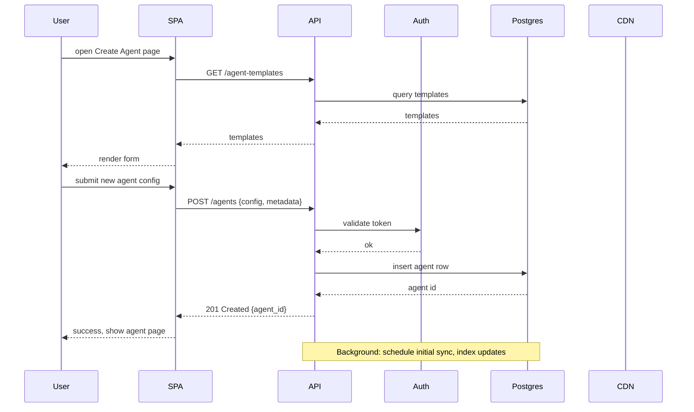

## Sequence Diagram — Agent Creation

```mermaid
sequenceDiagram
  participant User
  participant SPA
  participant API
  participant Auth
  participant Postgres
  participant CDN

  User->>SPA: open Create Agent page
  SPA->>API: GET /agent-templates
  API->>Postgres: query templates
  Postgres-->>API: templates
  API-->>SPA: templates
  SPA-->>User: render form

  User->>SPA: submit new agent config
  SPA->>API: POST /agents {config, metadata}
  API->>Auth: validate token
  Auth-->>API: ok
  API->>Postgres: insert agent row
  Postgres-->>API: agent id
  API-->>SPA: 201 Created {agent_id}
  SPA-->>User: success, show agent page

  note over API,Postgres: Background: schedule initial sync, index updates

```

Notes:
- The API performs validation and stores the agent config; an initial background job can seed tasks or validate external tool integrations.
