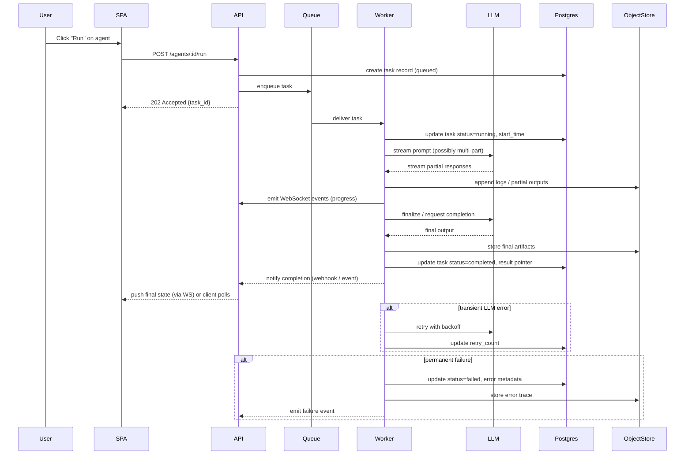

## Sequence Diagram — Task Execution & LLM Calls

Notes:
- Workers stream LLM responses to Object Storage and emit progress via WebSocket or server-sent events for real-time UI updates.
- Retries and circuit breaker patterns protect against flaky LLM providers.
